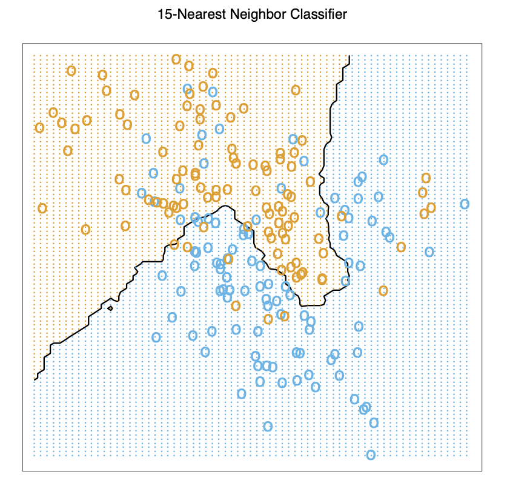
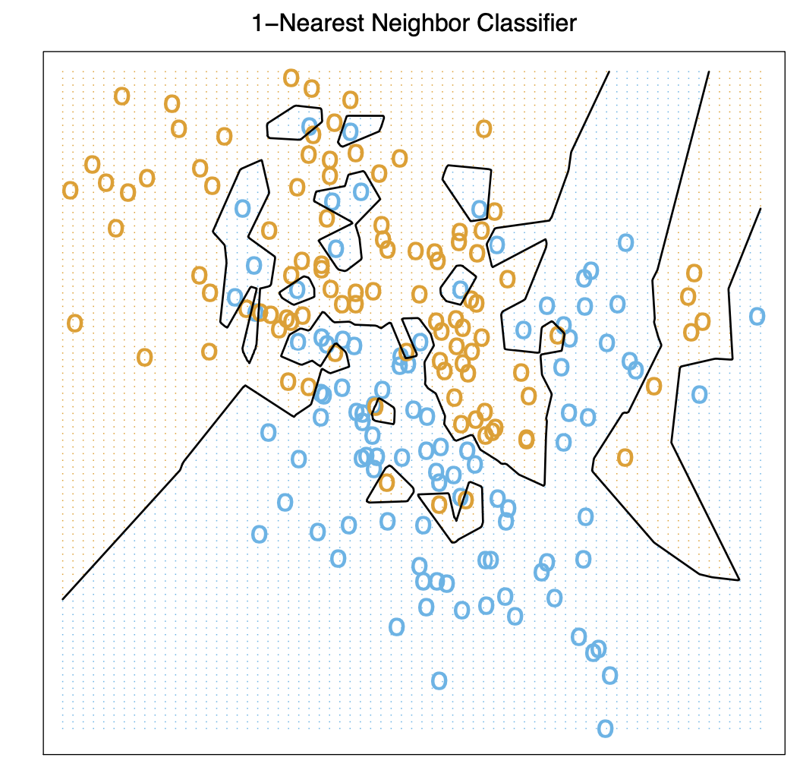

# Machine Learning  
This is a chapter of machine learning. Reference of book ESLII.  

## Least Square  
Least Square is most simple method for quantative prediction, which makes huge assumptions about structure and yields stable but possibly inaccurate predictions.  
  
### Basic Functions   
Basic functions are as follows:  
$X$ is a $1\times n$ column vector and $\hat Y$ is a single output:   
$$
\begin{align}
Input: vector \ X^T &= \begin{bmatrix} X_1, X_2,......, X_p \end{bmatrix}  \\
Coefficients: \ vector \ \beta&= \begin{bmatrix} \hat\beta_0\\ \hat\beta_1\\ ... \\ \hat\beta_p \end{bmatrix} \\
Prediction: scalar\ \hat Y &= \hat \beta_0+\sum_{j=1}^p X_j \hat \beta_j \\
&=X^T\beta
\end{align}
$$

$X$ is a $n\times p$ column vector and $\hat Y$ is a $n\times 1$ column vector:    
$$
\begin{align}
Input \ matrix: X_{n\times p} &= \begin{bmatrix}
X_1, X_2,......, X_p \end{bmatrix}\\
&=\begin{bmatrix}
...... ,x_{1j} ,......\\
......, x_{2j}, ......\\
......,x_{3j} ,......\\
.................\\
......,x_{nj}, ......\end{bmatrix}\\
Prediction: \hat Y_{n\times 1} &= \hat \beta_0+\sum_{j=1}^p X_j \hat \beta_j\\
&= \hat \beta_0 + \begin{bmatrix}
x_{11}\\
x_{21}\\
x_{31}\\
..\\
x_{n1}\end{bmatrix}\hat \beta_1+... + \begin{bmatrix}
x_{1j}\\
x_{2j}\\
x_{3j}\\
..\\
x_{nj}\end{bmatrix}\hat \beta_j+... + \begin{bmatrix}
x_{1p}\\
x_{2p}\\
x_{3p}\\
..\\
x_{np}\end{bmatrix}\hat \beta_p\\
&=X\beta \\
Bias \ \hat \beta_0 &: n\times 1 \\
X_j &: n\times 1 \\
X &: n\times p \\
\beta&: p\times 1
\end{align}
$$ 
    
$X$ is a $n\times p$ column vector and $\hat Y$ is a $n\times K$ matrix (fit different combinations of coefficients for different prediction):   
$$
\begin{align}
Input \ matrix: X_{n\times p} &= \begin{bmatrix}
X_1, X_2,......, X_p \end{bmatrix}\\
&=\begin{bmatrix}
...... ,x_{1j} ,......\\
......, x_{2j}, ......\\
......,x_{3j} ,......\\
.................\\
......,x_{nj}, ......\end{bmatrix}\\
Prediction: \hat Y_{n\times K} &= \hat \beta_0+\sum_{j=1}^p X_j \hat \beta_j\\
&=  \begin{bmatrix} \hat\beta_{01},\hat\beta_{02},...,\hat\beta_{0K}\\ \hat\beta_{01},\hat\beta_{02},...,\hat\beta_{0K}\\ \hat\beta_{01},\hat\beta_{02},...,\hat\beta_{0K}  \end{bmatrix} + \begin{bmatrix}
x_{11}\\
x_{21}\\
x_{31}\\
..\\
x_{n1}\end{bmatrix}\begin{bmatrix} \hat\beta_{11},\hat\beta_{12},...,\hat\beta_{1K} \end{bmatrix}    +... + \begin{bmatrix}
x_{1j}\\
x_{2j}\\
x_{3j}\\
..\\
x_{nj}\end{bmatrix} \begin{bmatrix} \hat\beta_{j1},\hat\beta_{j2},...,\hat\beta_{jK} \end{bmatrix}   +... + \begin{bmatrix}
x_{1p}\\
x_{2p}\\
x_{3p}\\
..\\
x_{np}\end{bmatrix}\begin{bmatrix} \hat\beta_{p1},\hat\beta_{p2},...,\hat\beta_{pK} \end{bmatrix} \\
Bias \ \hat \beta_0 : n\times K \\
X_j : n\times 1
\end{align}
$$
    
Summarize as:   
$$
\begin{align}
f(X) &=\hat Y= X \boldsymbol{\hat \beta}  \\
\hat Y &: n\times 1 \\
X &: n\times (p+1) \\
\boldsymbol{\hat \beta} &: (p+1)\times 1
\end{align}
$$
   
### Objection  
Minimizing Residual Sum Square (RSS) is usually used to fit coefficients. Since RSS is a quandratic function of $\beta$, therefore its minimum always exists.  
$$
\begin{align}
RSS(\beta) &=\sum_{i=1}^N (y_i-X_i^T\beta)^2 \\
&= (Y-X\beta)^T(Y-X\beta)
\end{align}
$$
  
DIfferenciate RSS:  
$$
\begin{align}
\frac{dRSS}{d\beta}&=X^T(Y-X\beta)=0\\
X^TX\beta&=X^TY \\
\beta&=(X^TX)^{-1}X^TY
\end{align}
$$
  
### Summary 
- More fit for **Scenario**: The training data in each class were generated from bivariate Gaussian distributions with uncorrelated components and different means.

## Nearest Neighbor {#nearest-neighbor}  

  
   

### Basic Functions  
$N_k(x)$ is neighbor of x, assuming Euclidean distance.  
$$
\begin{align}
\hat Y(x) &=\frac{1}{k}\sum_{x_i\in N_k(x)} y_i \\
\end{align}
$$
  
### Summary  
- Effective number of parameters for KNN is $N/k$ while for MLS is p (number of $\beta_i$), although it seems the number of neighbors k is number of parameter of KNN while p is number of parameter of MLS. And $N/k$ is usually larger than p.  
To get an idea of why, if all neighborhoods are nonoverlapping, KNN computes $N/k$ parameters (one mean for each neighborhoods).  
- More fit for **Scenario**: The training data in each class came from a mixture of 10 low- variance Gaussian distributions, with individual means themselves distributed as Gaussian.  
- We cannot use Sum Square Error for KNN, because it will always goes to k=1.  

### From Least Square to Nearest Neighbor  
|            | Least Square                                                                                                                           | K Nearest Neighbor                                                                                                                                          |
|------------|----------------------------------------------------------------------------------------------------------------------------------------|-------------------------------------------------------------------------------------------------------------------------------------------------------------|
| Assumption | a linear boundary is appropriate                                                                                                       | no straight assumption                                                                                                                                      |
| Reason     |                                                                                                                                        | Depends on hadful points and their particular position, slightly changes may cause result changing.                                                         |
| Variance   | low                                                                                                                                    | high                                                                                                                                                        |
| Bias       | high                                                                                                                                   | low                                                                                                                                                         |
| Stability  |                                                                                                                                        | unstable                                                                                                                                                    |
| Scenario   | The training data in each class were generated from bivariate Gaussian distributions with uncorrelated components and different means. | The training data in each class came from a mixture of 10 low- variance Gaussian distributions, with individual means themselves distributed as Gaussian.   |

  
**Methods to enhance KNN and LS**  

- Kernel methods use weights that decrease smoothly to zero with dis- tance from the target point, rather than the effective 0/1 weights used by k-nearest neighbors.  
- In high-dimensional spaces the distance kernels are modified to em-phasize some variable more than others.  
- Local regression fits linear models by **locally weighted least squares**, rather than fitting constants locally.  
- Linear models fit to a basis expansion of the original inputs allow arbitrarily complex models.   
- Projection pursuit and neural network models consist of sums of non-linearly transformed linear models.  

## Statistical Decision Theory {#sdtheory}  
Let $X \in R^p$ denote a real valued random input vector, and $Y \in R$ a real valued random output variable, with joint distribution $Pr(X,Y)$. We seek a function $f(X)$
for predicting $Y$ given values of the input $X$. This theory requires a loss function $L(Y,f(X))$ for **penalizing errors in prediction**, and by far the most 
common and convenient is squared error loss: $L(Y,f(X)) = (Y −f(X))^2$ . This leads us to a criterion for choosing $f$.  
**Expected Prediction Error (EPE)**  
$$
\begin{align}
EPE(f) &= E((Y-f(X))^2) \\
&= \int (y-f(x))^2 Pr(dx,dy)
\end{align}
$$
**By conditioning on x**: 
$$
\begin{align}
EPE=E_X E_{Y|X}([Y-f(x)]^2|X)
\end{align}
$$
  
> Conditional Expectation: 
$$\begin{align} E_{XY}(\alpha)&= E_{X}E_{Y|X}(\alpha|X)\\ &=E_{Y}E_{X|Y}(\alpha|Y) \end{align}$$

**munimize EPE pointwise**:  
$$
f(x) = min EPE= argmin_c \ E_{Y|X}([Y-c]^2|X=x)
$$
  
**Solution**:  
$$
f(x)=E(Y|X=x)
$$
  
Best prediction of Y at any point $X=x$ is the conditional mean (when measured by **average square error**).  

### KNN fit into this framework  
For KNN, this receipt is directly applied, since average of each neigborhoods is computed.  
$$ 
\hat f(x)=Ave(y_i|x_i x_i\in N_k(x))  \\
N,k \rightarrow \infty, \frac{k}{N} \rightarrow 0,\hat f(x) \rightarrow E(Y|X=x)
$$

**2 Assumption here**:  

- Expectation is approximated by averaging over sample data.  
- Conditioning at a point is relaxed to conditioning on some region “close” to the target point. (k gets larger, average more stable)  

### Linear Regression fit into this framework  
**If assume $f(x)=X\beta$**  
$$
f(x)\approx x^T\beta
$$
**Into EPE then differentiate**  
$$
\begin{align}
EPE &=E((Y-f(X))^2)\\
&= E((Y-X^T\beta)^2) \\
&=E(Y^TY)+E[(X^T\beta)^TX^T\beta]-2E[X\beta Y]\\
Diff: \ \frac{dEPE}{d\beta} &=2\beta\beta^T E(XX^T)=2\beta E[XY] \\
\beta&= E[XX^T]^{-1}E[XY]
\end{align} 
$$
For least square, it uses average values to represent expectations.  

### Summary  
So both k-nearest neighbors and least squares end up approximating conditional expectations by averages. But they differ dramatically in terms of model assumptions:  

- Least squares assumes $f(x)$ is well approximated by a globally linear function.  
- k-nearest neighbors assumes $f(x)$ is well approximated by a locally constant function.  

